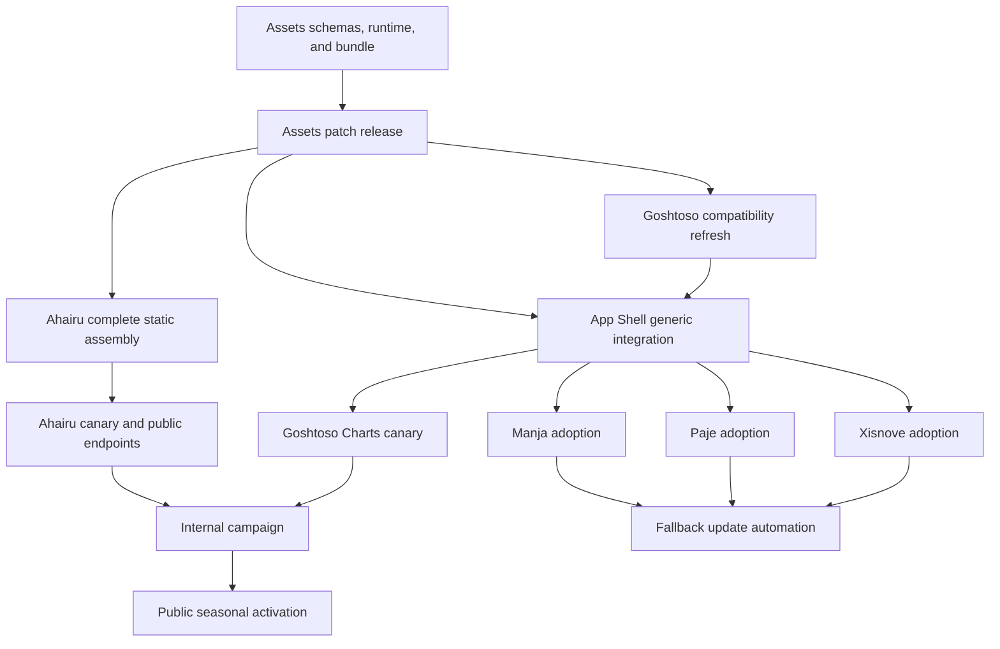

# Seasonal Assets Program Implementation Plan

> **For agentic workers:** REQUIRED SUB-SKILL: Use superpowers:subagent-driven-development (recommended) or superpowers:executing-plans to implement this plan task-by-task. Steps use checkbox (`- [ ]`) syntax for tracking.

**Goal:** Publish and adopt immutable Arai Hû asset releases, mutable presentation channels, and safe seasonal campaign behavior across every relevant Arai Hû web project.

**Architecture:** Assets builds and validates all portable contracts. Ahairu assembles complete Assets artifacts into its existing Worker Static Assets deployment. Goshtoso remains brand-neutral; Goshtoso App Shells exposes generic enrollment hooks; individual web applications opt in and retain catalog-selected embedded fallbacks.

**Tech Stack:** Go 1.26.5, strict YAML/JSON, vanilla deferred JavaScript, templ, Goshtoso, GitHub Actions, Cloudflare Workers Static Assets, Node test runner, Puppeteer/Playwright where already present.

## Global Constraints

- Preserve `dist/catalog.json` schema v1 and its patch-compatibility rules.
- Keep all public asset references below `https://araihu.com/assets/` and immutable release paths below `/assets/releases/vMAJOR.MINOR.PATCH/`.
- Cache channel JSON for 60 seconds with revalidation; cache immutable release files for 31,536,000 seconds with `immutable`.
- Campaign dates are UTC `YYYY-MM-DD`; `starts_on` and `ends_on` are inclusive; no time-of-day fields.
- Reject overlapping enabled campaigns and unresolved asset/theme references.
- Explicit user theme preference wins over campaign opt-out, active campaign, and default, in that order.
- Runtime inputs are data only: no manifest HTML, scripts, callbacks, or application business logic.
- Applications render an embedded baseline first and explicitly enroll the deferred runtime.
- The Ahairu Worker performs routing and serving only; campaign resolution happens in deterministic CI/CLI work.
- Ahairu deploys one complete static tree and retains every previously published immutable release.
- Clients generate their own static types from canonical catalog names.
- Preserve user-owned dirty primary checkouts; all mutations use isolated worktrees.
- Use Go 1.26.5 for every touched Go module and CI job.
- Regenerate templ and bundled artifacts through repository commands; never hand-edit generated files.

---

## Repository classification

| Repository | Program role | Required mutation |
|---|---|---|
| `assets` | Source, schemas, CLI, runtime, immutable/channel bundles | Yes |
| `ahairu` | Worker host, `/brand`, `/license`, first canary | Yes |
| `goshtoso` | Generic icon/theme primitives and showcase | Compatibility/update only; current `v0.1.0` already satisfies the icon showcase requirement |
| `goshtoso-app-shells` | Generic first-paint, hook, toggle, and runtime enrollment API | Yes |
| `goshtoso-charts` | App-shell canary and theme-reactivity proof | Yes |
| `manja` | Embedded fallback and explicit enrollment for app and product site | Yes, after current active work is safely based |
| `paje` | Embedded fallback and explicit enrollment for product site | Yes |
| `xisnove` | Embedded fallback and explicit enrollment for UI and product site | Queued until active dirty milestone/site ownership is reconciled |
| `metaru` | Imported backend/docs, no visual consumer | Go toolchain alignment only |
| `fly-deploy` | Deployment infrastructure, no visual consumer | No asset mutation; verify dispatch remains unnecessary |

No native mobile repository exists in the workspace. Mobile delivery ends at immutable catalogs and platform artifacts in this program.

## Dependency graph

## Plan set and acceptance gates

### Plan A: Assets control plane

**Plan:** `docs/superpowers/plans/2026-07-29-assets-control-plane.md`

**Produces:** strict theme/campaign/release/channel schemas, deterministic CLI commands, deferred runtime, complete immutable and channel bundles, workflows, and a patch release.

**Gate:** full offline Assets verification passes twice from a clean worktree and produced bytes are identical.

### Plan B: Ahairu delivery and canary

**Plan:** `docs/superpowers/plans/2026-07-29-ahairu-assets-delivery.md`

**Consumes:** the exact released outputs from Plan A.

**Produces:** complete static assembly, extensionless channel routing, exact cache headers, runtime enrollment, brand hooks, and verified `/brand` and `/license` downloads.

**Gate:** `npm run check`, local Worker probes, and deployed public probes pass; prior Worker version remains available for rollback.

### Plan C: Goshtoso and App Shell contracts

**Plan:** `docs/superpowers/plans/2026-07-29-goshtoso-app-shell-campaigns.md`

**Consumes:** Assets catalog/runtime schemas.

**Produces:** compatibility proof in Goshtoso and generic opt-in configuration, first-paint source marker, declared brand/toggle hooks, and runtime ordering in both App Shells.

**Gate:** generated files clean, all Go tests/vet pass, and shell failure/preference tests pass.

### Plan D: Downstream adoption

**Plan:** `docs/superpowers/plans/2026-07-29-downstream-assets-adoption.md`

**Consumes:** released Assets and App Shell versions.

**Produces:** enrolled Goshtoso Charts, Manja, Pajé, and Xisnove web surfaces with immutable embedded fallbacks. Aligns remaining Go toolchains to 1.26.5.

**Gate:** each repository's focused and full gates pass in isolation; caller-provided Manja branding and Xisnove CSP remain intact.

### Plan E: Automation, release, and activation

**Plan:** `docs/superpowers/plans/2026-07-29-seasonal-assets-release.md`

**Consumes:** accepted commits and tags from Plans A-D.

**Produces:** selected-repository GitHub App dispatch/update workflows, complete Worker deployment, live endpoint verification, internal campaign evidence, and public activation procedure.

**Gate:** immutable paths survive a subsequent deployment, channels converge within 60 seconds, opt-out/preference behavior passes in the canary, and all worker sessions have a verified disposition.

## Control-plane execution policy

- Default to two active bounded worker sessions.
- Give each worker one repository or path-disjoint subsystem, exact base SHA, owned files, and acceptance commands.
- Do not base new work on dirty primary checkouts.
- Refresh remote refs before creating each worktree; use the accepted remote or integration branch named by the repository plan.
- Review each worker commit for spec compliance and code quality before integration.
- Use a fresh integration worker for every multi-commit batch.
- Run repository gates after integration, then cross-repository gates against released versions rather than local replaces.
- Queue Xisnove until its active milestone and untracked `site/` ownership are resolved; do not overwrite or normalize that checkout.
- Publish no tag, package, PR, or deployment until its preceding gate passes.

## Program completion evidence

- Assets release tag and immutable archive hashes.
- Public `latest`, `default`, and `current` channel bodies and headers.
- Public immutable release and runtime bodies and headers.
- `/brand` and `/license` metadata, downloads, checksums, and responsive rendering.
- Preference, opt-out, campaign apply, expiry, failure fallback, and reduced-motion browser evidence.
- Goshtoso sprite catalog/showcase equality and App Shell integration tests.
- Clean fallback-update commits or PRs for every relevant downstream repository.
- Exact Go 1.26.5 evidence for every touched module and CI workflow.
- Control-plane ledger with every session integrated, rejected, superseded, or intentionally queued.
