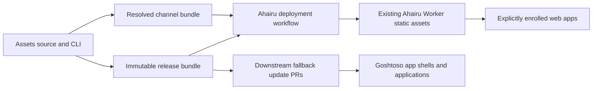

# Seasonal asset channels and shared identity distribution

**Status:** Approved design, awaiting implementation plan

**Target:** Post-`v0.1.0`, before `v1.0.0`

**Owners:** Arai Hû Assets, Ahairu, Goshtoso App Shells

## Summary

Arai Hû Assets will grow from a deterministic asset bundle into the source,
validator, and release control plane for shared visual identity. It will publish
normalized brand artwork, permissively licensed UI icons, SVG sprites, multiple
themes, and machine-readable release metadata. Web applications may opt into a
small deferred runtime that applies an active seasonal campaign without making
campaign policy part of Goshtoso or individual applications.

The first delivery uses the existing Ahairu Cloudflare Worker and its Static
Assets binding. It does not use R2. The Ahairu deployment workflow assembles the
site and one complete Assets-generated bundle, then deploys them as a single
Worker version. This keeps deployment atomic and leaves the preceding Worker
version available for rollback.

`v0.1.0` remains the first released Assets contract. Additive icons are patch
releases. Complete icon and sprite coverage remains a prerequisite for
`v1.0.0`.

## Goals

- Make the Assets repository useful to every current Arai Hû project and future
  asset work.
- Preserve deterministic generation, provenance, licensing, and visual review.
- Publish normalized brand icons and logos in the practical shapes, sizes,
  appearances, framings, and tinted or seasonal variants required by web and
  mobile products.
- Publish a curated, permissively licensed UI icon set and stable SVG sprite.
- Let clients generate their own static types from canonical catalog names.
- Publish multiple compatible themes and choose an explicitly promoted default.
- Activate date-bounded seasonal presentation for users without an explicit
  preference.
- Let a user opt out of the active campaign and restore the preceding or default
  theme.
- Preserve an embedded/local baseline when the network or runtime fails.
- Publish a brand proof at `/brand`, with distribution terms linked from
  `/license`, and complete site metadata.

## Non-goals

- Arbitrary HTML injection, manifest-provided executable code, or application
  business logic.
- Request-time campaign calculation in the Ahairu Worker.
- A Goshtoso-specific source generator in the Assets CLI.
- Seasonal policy in Goshtoso core.
- Automatic HTML response rewriting at the Worker edge.
- Native live-campaign behavior in mobile applications in the first version.
- R2 storage in the first version.

## Existing contracts to preserve

`dist/catalog.json` schema v1 remains the language-neutral catalog of generated
visual artifacts. Consumers continue to own any Go, TypeScript, Swift, Kotlin,
or other bindings generated from it. Canonical names and sprite symbols are the
source of truth; consumers must not derive names from file paths.

The existing patch compatibility rule remains intact: adding an icon is
patch-compatible only when every previous canonical asset and its semantics are
preserved. Renaming, removing, or changing the meaning of an existing asset is
not a patch change.

Goshtoso remains brand-neutral. Its general icon and theme primitives may render
catalog values, but Arai Hû names, artwork, campaign dates, and promotion policy
remain outside its public package.

## Release layout

The public contract is rooted below `https://araihu.com/assets/`:

```text
/assets/campaign/v1.js
/assets/releases/latest
/assets/releases/default
/assets/releases/current
/assets/releases/v0.1.0/release.json
/assets/releases/v0.1.0/catalog.json
/assets/releases/v0.1.0/themes.json
/assets/releases/v0.1.0/campaigns.json
/assets/releases/v0.1.0/checksums.txt
/assets/releases/v0.1.0/dist/...
```

The channel documents have distinct meanings:

- `latest` identifies the newest published release and is informational. A new
  tag may move it, but it never activates presentation by itself.
- `default` identifies an explicitly promoted baseline release and theme.
- `current` identifies the resolved active campaign presentation, or the
  current `default` when no campaign is active.

All paths inside a channel document are absolute paths on the configured channel
origin and point to an immutable versioned release. Ahairu is same-origin;
enrolled Arai Hû subdomains consume the canonical `https://araihu.com` asset
origin through anonymous CORS. A channel never points to another channel.

Versioned files use:

```text
Cache-Control: public, max-age=31536000, immutable
```

Channel documents use:

```text
Content-Type: application/json; charset=utf-8
Cache-Control: public, max-age=60, must-revalidate
```

The extensionless public channel paths map to generated JSON files. That mapping
may be a small Worker routing concern, but it performs no campaign calculation
and does not mutate channel content at request time.

The stable runtime entrypoint may use a short cache with revalidation. Its
versioned implementation, if split from the entrypoint, follows immutable
release caching.

## Release metadata

Each immutable release contains these complementary documents:

- `release.json`: schema version, release identity, identity revision, runtime
  compatibility, inventories, and hashes of the other release documents.
- `catalog.json`: existing schema-v1 visual catalog for brand and UI artifacts.
- `themes.json`: available themes, CSS paths, token-contract compatibility, and
  hashes.
- `campaigns.json`: the complete validated campaign calendar shipped by that
  release.
- `checksums.txt`: deterministic SHA-256 checksums for published files.

`catalog.json` stays focused on visual artifacts. Theme and campaign concerns
must not be forced into catalog schema v1.

Release documents use strict decoding: reject unknown or case-variant fields,
duplicate keys, trailing JSON values, traversal paths, unsupported schema
versions, and unresolved references. Generated JSON is deterministically
ordered, uses two-space indentation, and ends with one newline.

## Asset model

### Brand assets

Brand output covers the practical matrix established by the identity proof:

- icon and horizontal logo artwork;
- transparent and background-framed forms;
- protected-color, monochrome, and explicitly tintable forms;
- light and dark surface intent;
- platform exports and common favicon/application sizes;
- approved seasonal variants.

The catalog describes behavior rather than asking consumers to guess it.
Protected-color artwork is never recolored by a component. A tintable asset may
inherit a documented color. Fixed output dimensions and intrinsic aspect ratios
prevent campaign swaps from causing layout shift.

### UI icons

UI icons are selected by manifest from permissively licensed upstream sets. The
Heroicons source declaration uses a pinned upstream revision, an `hi` alias,
and explicit paths such as `16/solid/academic-cap.svg`. Generated paths and
symbols remain deterministic:

```text
dist/icons/ui/heroicons/16-solid-academic-cap.svg
hi-16-solid-academic-cap
```

The initial selection is derived from common application needs and actual icon
usage in Goshtoso components and its demo. It is not constrained to an arbitrary
count. Provenance, license, source revision, source path, and hash are recorded.

### Sprites and client types

Sprites contain only catalog-declared symbols. Symbol IDs are unique and stable.
Clients read the published catalog and own their language-specific generation.
Goshtoso may introduce the first Go generator and typed helper, but Assets does
not expose a `--language go` command.

## Theme model

A release may contain multiple themes. `themes.json` identifies each theme and
the CSS token contract it implements. Validation proves that required variables
exist and that referenced CSS belongs to the immutable release.

The promoted `default` channel selects a baseline release and theme. This makes
the organization default intentional and auditable without forcing existing
users away from an explicit preference.

## Campaign calendar

The source manifest contains a list of date-bounded campaigns:

```yaml
campaigns:
  - id: halloween-2026
    enabled: true
    starts_on: 2026-10-01
    ends_on: 2026-10-31
    theme: araihu-halloween
    toggle:
      enabled_icon: campaign-pumpkin-solid
      disabled_icon: campaign-pumpkin-outline
    brand:
      logo: brand-araihu-halloween
      icon: brand-araihu-icon-halloween
```

`starts_on` and `ends_on` are UTC calendar dates in `YYYY-MM-DD` form. Both are
inclusive. A campaign becomes inactive at `00:00 UTC` on the day after
`ends_on`. Time-of-day and timezone fields are deliberately absent.

Enabled campaigns may not overlap. The validator also rejects duplicate IDs,
inverted ranges, missing themes, missing icons or brand assets, incompatible
runtime versions, and references outside the same immutable release.

Disabling or editing an active campaign is an intentional channel-changing
operation. An unrelated asset commit or release cannot move `default` or
`current`.

## Channel resolution

Resolution is deterministic for an input release, promoted default, campaign
manifest, and UTC date:

1. Validate all release documents and references.
2. Find the single enabled campaign containing the input date.
3. If found, produce `current` with that campaign's theme, toggle symbols, and
   brand substitutions.
4. Otherwise, produce `current` from the promoted `default` selection.
5. Compute the complete resolved-document digest.
6. If the digest is unchanged, do not deploy.
7. If it changed, dispatch one complete Ahairu static deployment.

No generated timestamp is included merely to force a digest change.

## Browser runtime

Participating applications explicitly load `/assets/campaign/v1.js` with
`defer`. The Worker does not inject it. Applications render their embedded or
local baseline immediately; campaign activation is progressive enhancement and
may create a short visual transition, but must not create layout shift.

The root element exposes:

```text
data-theme="<theme>"
data-campaign="<campaign-id>"
data-theme-source="default|preference|campaign|campaign-opt-out"
```

App shells set the initial preference marker before the deferred runtime runs.
The DOM contract is application-neutral and can be adopted without Goshtoso.

The runtime may only:

- set the documented root attributes and CSS hooks;
- load declared theme CSS before changing `data-theme`;
- preload and decode declared brand images before replacing their URLs;
- render the declared enabled or disabled toggle icon;
- persist a campaign-specific opt-out;
- restore the preceding or default theme;
- dispatch documented lifecycle events.

Direct image icons are supported. For sprite icons, the runtime fetches the
same-origin sprite and safely inlines the selected known symbol rather than
depending on a cross-origin external `<use>` reference.

The runtime cannot inject manifest HTML, execute a manifest URL, inspect
authentication state, read arbitrary application storage, or invoke application
business logic.

## Preference precedence

Presentation resolves in this order:

```text
explicit user theme
> active-campaign opt-out restoration
> active campaign
> application or promoted default
```

An explicit user preference prevents seasonal activation. The campaign toggle
opts out of the active campaign only and restores the preceding application or
default theme. Clearing an explicit theme preference makes the active campaign
eligible again unless the same campaign remains opted out. Campaign storage
keys include the campaign ID so a prior opt-out does not disable future
campaigns.

If the channel, CSS, sprite, or image cannot load or validate, the runtime
leaves the current DOM unchanged. It respects `prefers-reduced-motion` when an
application styles the documented transition hooks.

## Repository ownership



- **Assets** owns source artwork, themes, icon manifests, provenance,
  generation, schemas, validation, the campaign calendar, the deterministic Go
  CLI, the runtime, and release/channel bundles.
- **Ahairu** owns Cloudflare authority and assembles its site plus the generated
  bundle into one Worker Static Assets deployment. The Worker serves files and
  does no request-time campaign computation.
- **Goshtoso** owns brand-neutral icon and theme primitives and compatibility
  tests for the shared token contract.
- **Goshtoso App Shells** owns convenient hook markup, toggle placement,
  first-paint preference markers, and embedded fallback integration.
- **Web applications** explicitly enroll and retain a local baseline.
- **Mobile applications** consume immutable catalogs and embedded artifacts.
  Native live campaigns require a future, explicit design.

Assets and Ahairu communicate through generated artifacts, not a shared working
directory. A selected-repository GitHub App may dispatch the Ahairu deployment
workflow and later open embedded-fallback update pull requests. Cloudflare
deployment credentials remain only in Ahairu.

## CI and publication

Pull requests validate assets, licenses, schemas, date rules, references,
determinism, generated output, and tests. A release tag publishes the immutable
bundle and moves `latest` only. Moving `default` is a separate manual promotion.

Campaign resolution runs:

- daily at `00:00 UTC`;
- by manual workflow dispatch;
- immediately after a campaign or default-promotion manifest change.

Only those explicit paths may request channel publication. Ordinary commits and
tags cannot implicitly promote `default` or change `current`. Publication uses
one concurrency group. A newer resolver run supersedes an older queued run, but
must not interrupt an active Ahairu deployment halfway through assembly.

The deterministic, credential-free CLI contract is:

```text
araihu-assets campaigns validate
araihu-assets campaigns resolve --date 2026-10-31
araihu-assets campaigns publish --date 2026-10-31 --output <directory>
araihu-assets themes validate
```

CI owns GitHub App and deployment credentials. The CLI reads files, validates,
and writes a complete output directory; it never calls GitHub or Cloudflare.

## Atomic deployment and rollback

The Ahairu workflow enumerates every published Assets tag, downloads and verifies
each immutable release bundle, downloads the resolved channel bundle, assembles
all of them with the site, validates the final tree, and creates one Worker
Static Assets version. It does not partially upload a channel over an existing
deployment.

Failure behavior is conservative:

- Failed validation publishes nothing.
- Failed assembly or Worker deployment leaves the previous Worker version live.
- Failed browser fetch or asset preload leaves the embedded baseline visible.
- An unsupported runtime or schema version is ignored.

Rollback redeploys the preceding complete Ahairu Worker version or explicitly
promotes a prior default release. After a successful corrective deployment,
users converge within the one-minute channel cache window.

## Security and integrity

- Public runtime inputs are declarative data, never executable extensions.
- Runtime URLs are HTTPS and every resolved asset URL shares the configured
  channel origin. Ahairu is same-origin; public Arai Hû subdomains use anonymous
  CORS from `https://araihu.com` with no credentials.
- Paths are normalized below their immutable release root and cannot traverse.
- SVG use is limited to validated files and known symbol IDs.
- Release files carry SHA-256 checksums for CI and downstream verification.
- Applications may pin SRI for the stable `campaign/v1.js` entrypoint. Runtime
  hashing of every fetched asset is not required in the first version.
- CSP remains application-owned; explicit enrollment declares required script
  and stylesheet origins.
- The campaign runtime has no access to authentication data.
- Local storage keys are documented, namespaced, and schema-versioned.
- Cross-repository GitHub App access is limited to selected repositories and
  the minimum contents, actions, and pull-request permissions required.

## Verification strategy

### Go CLI and schema tests

- inclusive start and end dates;
- UTC rollover after `ends_on`;
- disabled and overlapping campaigns;
- duplicate IDs and inverted ranges;
- missing theme, icon, logo, and release references;
- traversal and unsupported schemas;
- deterministic output, ordering, newline, and checksums;
- unchanged digest producing no publication action.

### Asset and theme tests

- SVG normalization and unique stable sprite symbols;
- exact source revision, provenance, and permissive license records;
- brand geometry, aspect ratio, framing, and color behavior;
- required theme tokens and compatibility declaration;
- catalog patch-compatibility against the previous release.

### Browser runtime tests

- explicit theme preference wins;
- campaign applies only without an explicit preference;
- campaign-specific opt-out restores the baseline;
- clearing a preference reapplies an eligible campaign;
- CSS load and image decode complete before DOM mutation;
- direct images and inline sprite symbols work;
- network, parse, load, and compatibility failures preserve the page;
- lifecycle events and root attributes are correct;
- decorative transitions respect reduced motion.

### Integration and publication tests

- Goshtoso App Shell first paint, deferred activation, toggle, persistence,
  reload, expiry, and failure fallback;
- exact cache headers for immutable and channel paths;
- complete immutable references in all channel documents;
- static deployment contains both the Ahairu site and Assets bundle;
- one deployment concurrency lock;
- unrelated commits cannot change channels;
- preceding Worker version remains deployable as rollback.

## Brand and icon review surfaces

The identity proof may become part of the Assets tool. The public `/brand` page
uses the same generated catalogs to show approved marks, variants, practical
sizes, usage guidance, downloads, checksums, and links to `/license`. It is a
consumer-facing proof and distribution surface, not the temporary V11 review
scaffold or an archive of rejected concepts. Git history remains the archive.

Goshtoso's icon component demo exposes every available sprite icon in a
responsive card grid: one column on narrow screens, three at intermediate
widths, and six at wide widths. Selecting a card opens a modal with component
options and a copy action that emits the exact icon component code. Options map
to the public icon component contract rather than Assets-specific behavior.

The public pages provide canonical URL, title, description, social preview,
favicon, theme color, robots policy, and structured metadata according to the
site metadata implementation guidance.

## Rollout sequence

1. Publish schemas, CLI commands, catalogs, themes, and runtime without an
   active campaign.
2. Add the Assets bundle to the Ahairu Worker Static Assets deployment and
   verify public paths, headers, rollback, `/brand`, `/license`, and metadata.
3. Explicitly enroll one Ahairu page as a canary.
4. Add generic integration hooks and the icon showcase to Goshtoso App Shells.
5. Configure selected-repository automation for embedded fallback pull
   requests.
6. Run a short internal, non-seasonal campaign and verify preference behavior.
7. Activate the first public seasonal campaign.

## Deferred decisions

- R2 becomes relevant only if Worker Static Assets file-count, retention, or
  deployment constraints become material.
- Native mobile campaign activation needs its own lifecycle, caching, and user
  preference design.
- Additional language generators belong in consuming projects and can be
  standardized after the first Goshtoso generator provides evidence.
- More expressive campaign effects require a new reviewed runtime schema, not
  unbounded fields in v1.
